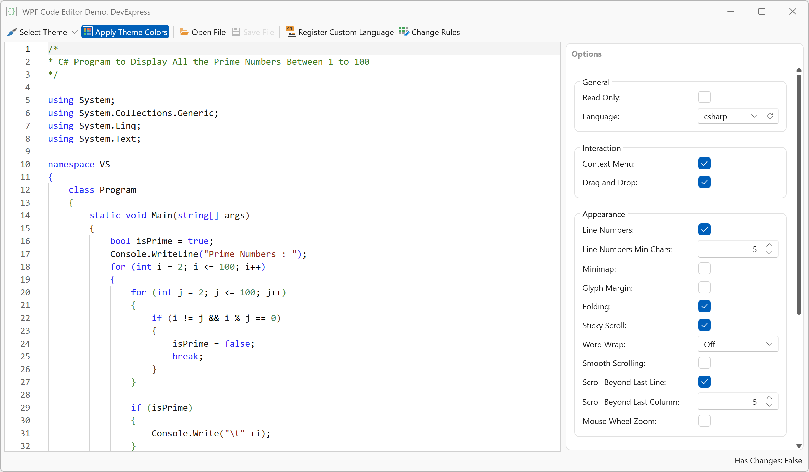

# WPF Monaco-Based Code Editor

> **NOTE**: The WPF `CodeEditor` control is available as part of this example. It is not included in the DevExpress WPF UI distribution.

This example wraps the open source [Monaco Editor (v0.55.1)](https://github.com/microsoft/monaco-editor). The editor is hosted inside Microsoft WebView2 and exposed through a reusable `CodeEditor` WPF control.



## Prerequisites

- .NET 8+
- Microsoft WebView2 Runtime
- Windows

## Features

The `CodeEditor` control exposes properties that map directly to Monaco Editor settings and can be configured at runtime.

Features include:

- 50+ Built-in Languages
- DevExpress Skin Integration
- Theme Token Rule Editor
- Configurable Editor Options (line numbers, minimap, folding, word wrap, and more)
- Track Changes
- Read-Only Mode
- Load/Save Files

### Content and State

- `Text` — Specifies editor content
- `ReadOnly` — Enables read-only mode
- `IsModified` — Indicates whether unsaved changes exist

```csharp
codeEditor.Text = "public class Demo { }";
codeEditor.ReadOnly = false;
bool isModified = codeEditor.IsModified;
```

### Language

The `CodeEditor` control supports 50+ built-in languages (C#, JavaScript, Python, SQL, XML, JSON, and more) and allows you to register custom programming languages as needs dictate.

```csharp
// Specify a programming language using a Monaco language identifier.
// For example, csharp, javascript, python, sql, json, etc.
codeEditor.EditorLanguage = "csharp";
```

Use the `RegisterLanguage` method to add a new language definition:

```csharp
codeEditor.RegisterLanguage(new LanguageDescriptor {
    Id = "myLang",            // Unique language identifier
    Monarch = "...",          // Tokenizer definition
    Configuration = "..."     // (optional) Language configuration
});
```

The `Monarch` property must contain a valid Monaco Monarch tokenizer definition provided as a JavaScript object literal.

Example:

```csharp
var language = new LanguageDescriptor {
    Id = "simpleLang",
    Monarch = @"
{
    tokenizer: {
        root: [
            [/[a-z_$][\w$]*/, 'identifier'],
            [/\d+/, 'number'],
            [/"".*?""/, 'string']
        ]
    }
}",
    Configuration = @"
{
    comments: {
        lineComment: '//'
    }
}"
};

codeEditor.RegisterLanguage(language);
```

### Appearance and Themes

```csharp
codeEditor.ShowLineNumbers = true;
codeEditor.ShowMinimap = true;
codeEditor.ShowGlyphMargin = false;
```

`ApplyDevExpressColors` is exposed by the `ThemeBehavior` attached to the editor:

```xml
<se:CodeEditor x:Name="CodeEditor">
    <dxmvvm:Interaction.Behaviors>
        <set:ThemeBehavior x:Name="ThemeBehavior"
                           ApplyDevExpressColors="True"
                           Rules="{Binding Rules}"/>
    </dxmvvm:Interaction.Behaviors>
</se:CodeEditor>
```

### Smooth Scrolling and Layout

```csharp
codeEditor.EnableSmoothScrolling = true;
codeEditor.EnableScrollBeyondLastLine = true;
codeEditor.ScrollBeyondLastColumn = 5;
codeEditor.EnableStickyScroll = true;
codeEditor.LineNumbersMinChars = 5;
codeEditor.TabSize = 4;
```

### Editing

```csharp
codeEditor.InsertSpaces = true;
codeEditor.DetectIndentation = true;
codeEditor.AutoIndent = EditorAutoIndent.Full;
codeEditor.WordWrap = EditorWordWrap.On;

// IntelliSense and suggestions
codeEditor.EnableQuickSuggestions = true;
codeEditor.EnableWordBasedSuggestions = true;
codeEditor.EnableSuggestOnTriggerCharacters = true;
codeEditor.EnableParameterHints = true;
```

### Interaction

- Context Menu
- Drag and Drop
- Zoom (`Ctrl` + mouse wheel)

```csharp
codeEditor.EnableContextMenu = true;
codeEditor.EnableDragAndDrop = true;
codeEditor.EnableMouseWheelZoom = false;
```

## Implementation Details

### Architecture

The `CodeEditor` control hosts the Monaco Editor inside a WebView2 instance and exposes it as a reusable WPF component.

```csharp
public class CodeEditor : Control, IDisposable {
    WebView2? webView;
    bool editorReady;
    readonly Dictionary<string, LanguageDescriptor> registeredLanguages = new();

    static CodeEditor() {
        DefaultStyleKeyProperty.OverrideMetadata(typeof(CodeEditor),
            new FrameworkPropertyMetadata(typeof(CodeEditor)));
    }

    public CodeEditor() {
        MarkAsSavedCommand = new DelegateCommand(MarkAsSaved);
    }

    public override void OnApplyTemplate() {
        base.OnApplyTemplate();

        WebView2? newWebView = GetTemplateChild("PART_WebView") as WebView2;
        if(newWebView == null)
            throw new InvalidOperationException("PART_WebView not found.");

        if(webView == newWebView)
            return;

        DetachWebView();
        AttachWebView(newWebView);
    }
}
```

### Communication Model

All interaction between C# and Monaco is handled via JSON messages over WebView2.

```csharp
void SendCommand(EditorCommandType type, object? payload = null) {
    if(!editorReady)
        return;

    EditorCommand cmd = new EditorCommand {
        Type = type,
        Payload = payload
    };

    JsonSerializerOptions options = new JsonSerializerOptions(JsonSerializerOptions.Web);
    string json = JsonSerializer.Serialize(cmd, options);
    webView?.CoreWebView2.PostWebMessageAsJson(json);
}
```

Incoming messages:

```csharp
void CoreWebView2_WebMessageReceived(object? sender, CoreWebView2WebMessageReceivedEventArgs e) {
    if(sender is not CoreWebView2)
        return;

    EditorMessage? message;
    try {
        message = JsonSerializer.Deserialize<EditorMessage>(e.WebMessageAsJson, JsonSerializerOptions.Web);
    } catch {
        return;
    }

    if(message?.Type == null)
        return;

    switch(message.Type) {
        case EditorMessageType.TextChanged:
            HandleTextChanged(message.Payload.GetString() ?? string.Empty);
            break;
        case EditorMessageType.EditorReady:
            HandleEditorReady();
            break;
        case EditorMessageType.IsDirtyChanged:
            IsModified = message.Payload.GetBoolean();
            break;
        case EditorMessageType.Languages:
            List<string> langs = new List<string>();
            foreach(JsonElement item in message.Payload.EnumerateArray()) {
                string? lang = item.GetString();
                if(lang != null)
                    langs.Add(lang);
            }
            LanguagesReceivedInternal?.Invoke(this, langs);
            break;
    }
}
```

### State Management

All properties are restored after initialization:

```csharp
void ApplyCurrentState() {
    RestoreRegisteredLanguages();

    SetEditorLanguage(EditorLanguage);
    SetEditorReadOnly(ReadOnly);
    SetEditorText(Text);
    SetShowLineNumbers(ShowLineNumbers);
    SetShowMinimap(ShowMinimap);
    SetShowGlyphMargin(ShowGlyphMargin);
    SetEnableFolding(EnableFolding);
    SetEnableContextMenu(EnableContextMenu);
    SetWordWrap(WordWrap);
    SetTheme(ThemeName);
    SetTabSize(TabSize);
    SetInsertSpaces(InsertSpaces);
    SetAutoIndent(AutoIndent);
    //...
}
```

### Editor Configuration

`CodeEditor` options are exposed as dependency properties:

```csharp
//codeEditor.ShowLineNumbers = true;

public static readonly DependencyProperty ShowLineNumbersProperty =
    DependencyProperty.Register(nameof(ShowLineNumbers), typeof(bool), typeof(CodeEditor),
        new PropertyMetadata(true, OnShowLineNumbersChanged));

public bool ShowLineNumbers {
    get { return (bool)GetValue(ShowLineNumbersProperty); }
    set { SetValue(ShowLineNumbersProperty, value); }
}

static void OnShowLineNumbersChanged(DependencyObject sender, DependencyPropertyChangedEventArgs e) {
    CodeEditor control = (CodeEditor)sender;
    control.SetShowLineNumbers((bool)e.NewValue);
}
```

### Programming Language Support

The `CodeEditor` supports both built-in and custom languages.

```csharp
public void RegisterLanguage(LanguageDescriptor language) {
    if(language == null)
        throw new ArgumentNullException(nameof(language));

    object payload = new {
        id = language.Id,
        monarch = language.Monarch,
        configuration = language.Configuration
    };
    SendCommand(EditorCommandType.RegisterLanguage, payload);
    registeredLanguages[language.Id] = language;
}
```

### Track Changes

The editor tracks unsaved changes. `IsModified` is a read-only dependency property, so it can be bound directly in XAML:

```xml
<dxb:BarButtonItem Content="Save File"
                   Command="{Binding SaveFileCommand}"
                   IsEnabled="{Binding ElementName=CodeEditor, Path=IsModified}"/>
```
